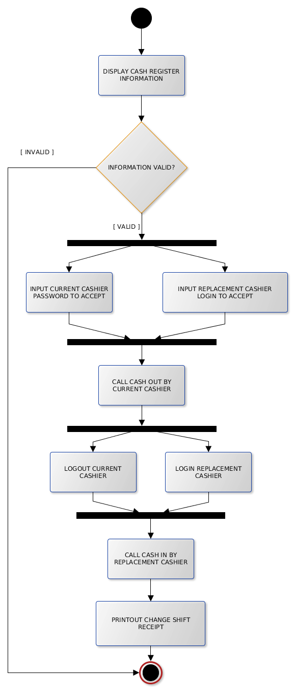

## Activity Diagram

Tampilan *activity diagram* mirip dengan *flowchart*. Kedua diagram ini memiliki tujuan yang sama yaitu menggambarkan
flow proses yang akan diimplementasikan ke dalam program.

Narasi pada *use case diagram* mendeskripsikan flow proses dengan menggunakan kata-kata. *Activity diagram*
menggambarkan flow proses menggunakan simbol-simbol.

*Activity diagram* untuk *use case* Coffee Shop:

1. Login

   
   
2. Logout

   
   
3. Add new user

   

4. Remove user (disable user)

   
   
5. Update user account

   
   
6. Add new product

   
   
7. Remove product

   
   
8. Update product

   
   
9. Order

   
   
10. Payment

    
    
11. POS & Cash Register Report

    
    
12. Cash In/Out

    
    
13. Ganti Shift

    
