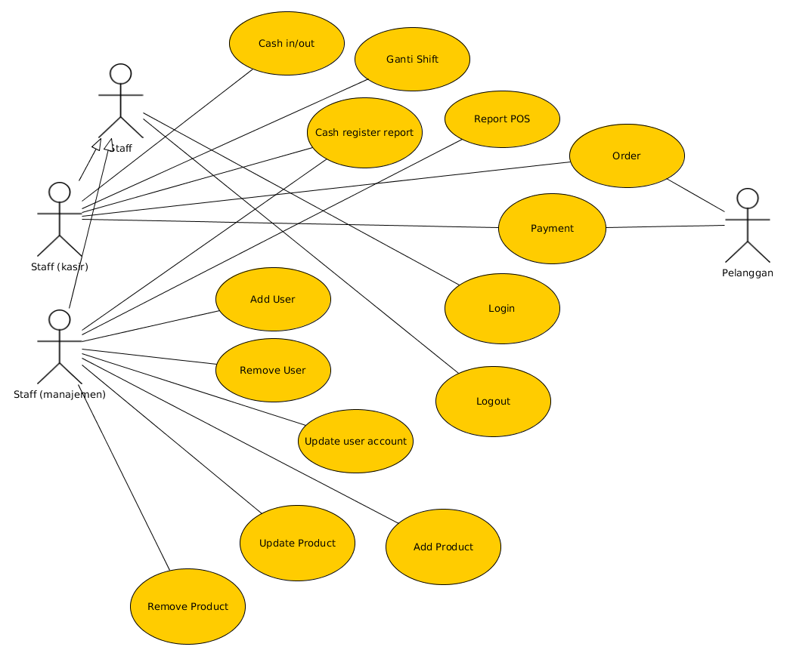

### Use Case Diagram

Berdasarkan *features* yang telah di-design, dibuatkan diagram *use case*.
     
   
   
Masing-masing use case perlu dibuatkan narasi.

1. Login
   
   **Description**
   
   User masuk ke sistem untuk tujuan meng-*establish* identitas user di dalam sistem (untuk keperluan pencatatan dan
   akuntibilitas).
   
   Seluruh fungsi sistem hanya dapat digunakan apabila user sudah login ke dalam sistem.

   **Normal Flow**
   
   1. User menyalakan aplikasi POS
   2. Aplikasi POS menampilkan halaman login
   3. User memasukkan user dan password untuk login ke sistem
   4. Sistem memeriksa user dan password, apabila valid dan masih aktif, user akan di-login-kan ke sistem
   5. User sudah dapat menggunakan aplikasi POS
   
   **Alternative Flow**
   
   User salah memasukkan user/password
   
   1. User memasukkan user/password yang salah
   2. Sistem menampilkan pesan kesalahan dan menunggu user untuk memasukkan user dan password lagi
   3. Ulangi proses normal flow langkah ke ii.
   
2. Logout

   **Description**

   User keluar dari sistem. Setiap user berkewajiban untuk logout dari sistem apabila sudah selesai menggunakan sistem.
   
   **Preconditions**
   
   User dalam keadaan login di sistem.

   **Normal Flow**
   
   1. User mengakses menu logout atau menekan tombol close pada aplikasi POS
   2. Sistem meng-logout user
   
3. Add User (user management)

   **Description**
   
   Menambahkan user baru ke dalam sistem.
   
   **Precondition**
   
   User sudah login sebagai user manajemen.

   **Normal Flow**
   
   1. User membuka menu user management dan menekan tombol add untuk menambahkan user baru.
   2. Sistem menampilkan form pendaftaran user baru
   3. User menginput data user baru:
      
      - nama lengkap
      - nama user
      - password & password verification
      - jenis user (kasir/manajemen)
      - optional mengupload foto
      
      dan menekan tombol save untuk menyimpan data user
      
   4. Sistem memeriksa validitas data user baru, menyimpan informasi user ke databse dan menampilkan pesan notifikasi
      ke user bahwa user sudah tersimpan.
      
4. Remove User (user management)

   **Description**
   
   Meng-nonaktifkan user. User yang sudah di-nonaktifkan tidak dapat login ke dalam sistem.
   
   **Precondition**
   
   User sudah login sebagai user manajemen.
   
   **Normal Flow**
   
   1. User membuka menu user management dan memilih account user yang akan dinonaktifkan.
   2. Sistem menampilkan form tampilan informasi account user.
   3. User menekan tombol non-aktif untuk meng-nonaktifkan user.
   4. Sistem mengupdate status keaktifan user ke database.
   
   Untuk mengaktifkan kembali user, lakukan flow yang sama.

5. Update user account (user management)

   **Description**
   
   Mengubah informasi mengenai user, misalnya nama lengkap atau password.
   
   **Precondition**
   
   User sudah login sebagai user manajemen.
   
   **Normal Flow**
   
   1. User membuka menu user management dan memilih account user yang akan di-update.
   2. Sistem menampilkan form tampilan informasi account user.
   3. User mengupdate informasi user dan menekan tombol save.
   4. Sistem menyimpan perubahan account user ke database.
   
6. Add Product (product management)

   **Description**
   
   Menambahkan product baru ke dalam sistem.
   
   **Precondition**
   
   User sudah login sebagai user manajemen.

   **Normal Flow**
   
   1. User membuka menu product management dan menekan tombol add untuk menambahkan product baru.
   2. Sistem menampilkan form pendaftaran product baru
   3. User menginput data product baru:
      
      - kode product
      - nama product
      - harga product
      - jenis product
      - optional mengupload foto
      
      dan menekan tombol save untuk menyimpan data product
      
   4. Sistem memeriksa validitas data product baru, menyimpan informasi product ke databse dan menampilkan pesan
      notifikasi ke user bahwa data sudah tersimpan.
      
7. Remove Product (product management)

   **Description**
   
   Meng-nonaktifkan product. Product yang sudah di-nonaktifkan tidak akan dimunculkan pada saat pelanggan melakukan
   order.
   
   **Precondition**
   
   User sudah login sebagai user manajemen.
   
   **Normal Flow**
   
   1. User membuka menu product management dan memilih product yang akan dinonaktifkan.
   2. Sistem menampilkan form tampilan informasi product.
   3. User menekan tombol non-aktif untuk meng-nonaktifkan product.
   4. Sistem mengupdate status keaktifan product ke database.
   
   Untuk mengaktifkan kembali product, lakukan flow yang sama.

8. Update Product (product management)

   **Description**
   
   Mengubah informasi mengenai product, misalnya harga atau foto product.
   
   **Precondition**
   
   User sudah login sebagai user manajemen.
   
   **Normal Flow**
   
   1. User membuka menu product management dan memilih product yang akan di-update.
   2. Sistem menampilkan form tampilan informasi product.
   3. User mengupdate informasi product dan menekan tombol save.
   4. Sistem menyimpan perubahan account product ke database.
   
9. Order

   **Description**
   
   Pelanggan melakukan order makanan/minuman.
   
   **Precondition**
   
   User sudah masuk ke dalam sistem sebagai user kasir.
   
   **Normal Flow**
   
   1. Pelanggan melakukan order kepada kasir sesuai dengan menu product yang tersedia.
   2. Staff menginput orderan pelanggan ke dalam sistem:
   
      - Product yang diorder
      - Jumlah (qty) product
   3. Sistem memeriksa validitas order dan kemudian menyimpan informasi order ke database.
   4. Sistem menampilkan total tagihan.
   
   **Alternative Flow**
   
   Pelanggan memesan product yang tidak aktif.
   
   1. Pada proses validasi order, sistem menampilkan notifikasi ke user bahwa product yang di-order tidak tersedia.
   2. User mengubah order atau membatalkan order sesuai dengan keputusan dari pelanggan.
   3. Sistem memvalidasi order. Jika sudah valid simpan data order ke database. Jika belum ulangi proses ini.
   4. Sistem menampilkan total tagihan (jika order tidak dibatalkan).
   
10. Payment

    **Description**
    
    Pelanggan membayar pesanan.
    
    **Precodition**
    
    User sudah masuk ke dalam sistem sebagai user kasir.
    Orderan pelanggan sudah disimpan oleh sistem (order valid).
    
    **Normal Flow**
    
    1. Staff kasir meminta pembayaran kepada pelanggan sesuai dengan total tagihan. Kemudian staff kasir menginput
       informasi pembayaran.
    2. Sistem merekam informasi pembayaran dan kemudian mencetak faktur order dan pembayaran.
    3. Staff kasir menginformasikan ke staff barista untuk membuat pesanan sesuai dengan faktur order dan pembayaran.
    
11. Report POS

    **Description**
    
    Menampilkan summary transaksi POS berdasarkan kriteria tertentu.
    
    **Precondition**
    
    User sudah login sebagai user manajemen.
   
    **Normal Flow**
   
    1. User mengakses menu laporan dan memilih laporan POS.
    2. Sistem menampilkan form untuk menerima input kriteria laporan.
    3. User menginput kriteria laporan dan mengklik tombol report.
    4. Sistem mengolah data report dan kemudian menampilkan laporan kepada user.
   
12. Report Cash Register

    **Description**
    
    Menampilkan summary transaksi cash register berdasarkan kriteria tertentu.
    
    **Precondition**
    
    User sudah login sebagai user manajemen.
   
    **Normal Flow**
   
    1. User mengakses menu laporan dan memilih laporan Cash Register.
    2. Sistem menampilkan form untuk menerima input kriteria laporan.
    3. User menginput kriteria laporan dan mengklik tombol report.
    4. Sistem mengolah data report dan kemudian menampilkan laporan kepada user.
   
13. Cash In/Out

    **Description**
    
    Proses memasukkan uang atau menarik uang dari cash register tanpa melalui proses penjualan.
    
    **Precondition**
    
    User sudah login sebagai user kasir.
    
    **Normal Flow**
    
    1. User mengakses menu cash register dan kemudian memilih menu cash in atau cash out.
    2. Sistem menampilkan form input data cash in/out.
    3. User menginput data cash in/out:
    
       * Jumlah
       * Keterangan
       
       dan kemudian menekan tombol save.
    4. Sistem menyimpan data cash in/out ke database dan mencetak faktur cash in/out.
    
14. Ganti Shift

    **Description**
    
    Proses pergantian shift user kasir. Pada proses ini, kedua kasir akan memeriksa jumlah uang di cash register dan
    melakukan serah terima cash register.
    
    **Precondition**
    
    User sudah login sebagai user kasir.
    
    **Normal Flow**
    
    1. User mengakses menu cash register, ganti shift.
    2. Sistem menampilkan form meminta informasi login kasir pengganti.
    3. Kasir pengganti memasukkan informasi login.
    4. Sistem memeriksa login kasir pengganti dan apabila valid tampilkan laporan cash register.
    5. Kasir pertama dan kasir pengganti sama-sama memeriksa dan laporan cash register. Jika sudah benar.
       Kasir pertama akan menekan tombol SERAH dan menginput password usernya. Sedangkan kasir pengganti akan menekan
       TERIMA dan menginput password usernya.
    6. Sistem mencetak faktur serah terima dan meng-logout kasir pertama dan berikutnya meng-login kasir pengganti.
